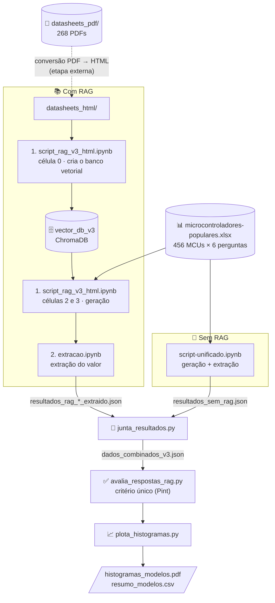
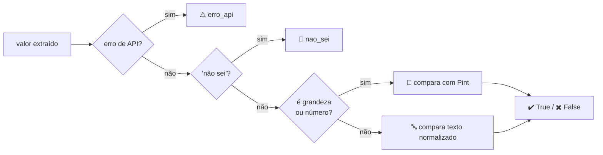

<div align="center">

# LLMs × Datasheets de Microcontroladores

**Avaliação de modelos de linguagem na extração de especificações técnicas de microcontroladores,<br>com e sem RAG, com e sem instrução.**

<!-- TODO: substituir pelo título da dissertação, programa e instituição -->
*Código da dissertação de mestrado — [Avaliação da Ocorrência de Alucinações em LLMs e RAG como Técnica de Mitigação, no Contexto de Datasheets de Microcontroladores] · [PPGESE] · [UFSC]*

<br>


<br>

| 🧩 **456** microcontroladores | ❓ **2.736** perguntas | 📄 **268** datasheets | 🏭 **9** fabricantes | 🧪 **4** categorias de teste |
|:---:|:---:|:---:|:---:|:---:|

</div>

---

## 📖 Sumário

- [Sobre o projeto](#-sobre-o-projeto)
- [Desenho experimental](#-desenho-experimental)
- [Fluxo de execução](#-fluxo-de-execução)
- [Estrutura do repositório](#-estrutura-do-repositório)
- [Instalação](#-instalação)
- [Configuração das chaves de API](#-configuração-das-chaves-de-api)
- [Como executar](#-como-executar)
- [Critério de avaliação](#-critério-de-avaliação)
- [Formato dos resultados](#-formato-dos-resultados)

---

## 🎯 Sobre o projeto

Modelos de linguagem respondem com fluência a perguntas técnicas, mas **nem sempre acertam os números**. Este projeto mede com que frequência LLMs acertam especificações de microcontroladores reais e investiga dois fatores:

- **RAG (*Retrieval-Augmented Generation*):** fornecer ao modelo trechos dos datasheets oficiais melhora a precisão?
- **Instrução:** pedir explicitamente *"Se não souber a resposta, retorne 'Não sei'"* reduz as respostas erradas?

Para cada microcontrolador da base, seis perguntas são feitas aos modelos. As respostas são comparadas com os valores de referência da planilha.

| # | Pergunta (exemplo com o ATmega328P-PU) | Resposta de referência | Tipo |
|:-:|---|:-:|:-:|
| 01 | Qual a memória flash do microcontrolador…? | `32KB` | 🔢 grandeza |
| 02 | Qual a velocidade (clock) do microcontrolador…? | `20MHz` | 🔢 grandeza |
| 03 | Qual a quantidade de entradas e saídas (I/O)…? | `23` | 🔢 número |
| 04 | O microcontrolador… possui comunicação CANBus? | `Não` | ✅ sim / não |
| 05 | O microcontrolador… possui comunicação I2C? | `Sim` | ✅ sim / não |
| 06 | O microcontrolador… possui comunicação Ethernet? | `Não` | ✅ sim / não |

---

## 🧪 Desenho experimental

Cada modelo é avaliado em **quatro categorias**, resultado do cruzamento de dois fatores:

<div align="center">

|  | **Sem instrução** | **Com instrução** <br><sub>"Se não souber, retorne 'Não sei'"</sub> |
|:---:|:---:|:---:|
| **Sem RAG** <br><sub>só o conhecimento do modelo</sub> | `sem_rag_sem_instrucao` | `sem_rag_com_instrucao` |
| **Com RAG** <br><sub>+ trechos dos datasheets</sub> | `com_rag_sem_instrucao` | `com_rag_com_instrucao` |

</div>

As duas variantes de instrução de uma mesma pergunta usam **exatamente o mesmo contexto recuperado**. Assim, a única diferença entre elas é a instrução.

### 🤖 Modelos avaliados

| Modelo | Provedor | Sem RAG | Com RAG |
|---|---|:-:|:-:|
| `gemini-2.5-flash` | Google Gemini | ✅ | ✅ |
| `microsoft/phi-4-mini-instruct` | NVIDIA NIM | | ✅ |
| `openai/gpt-oss-20b` | NVIDIA NIM | ✅ |✅|
| `@cf/meta/llama-4-scout-17b-16e-instruct` | Cloudflare Workers AI | ✅ |✅|
| `@cf/meta/llama-3.3-70b-instruct-fp8-fast` | Cloudflare Workers AI | ✅ |✅|
| `@cf/mistralai/mistral-small-3.1-24b-instruct` | Cloudflare Workers AI | ✅ |✅|
| `@cf/google/gemma-3-12b-it` | Cloudflare Workers AI | ✅ |✅|

<details>
<summary><b>⚙️ Parâmetros do RAG</b></summary>

<br>

| Parâmetro | Valor |
|---|---|
| Modelo de embedding | `qwen3-embedding` (local, via Ollama) |
| Banco vetorial | ChromaDB, distância de cosseno |
| Tamanho do chunk / sobreposição | 768 / 120 caracteres |
| Candidatos recuperados | 20 |
| Chunks enviados ao modelo | 5 (após filtrar pelo modelo do microcontrolador e remover duplicatas) |
| Extração de texto | `unstructured` (`partition_html`) |

O filtro usa o *part number* citado na pergunta (ex.: `ATMEGA328P`, `STM32F103`) e dá preferência aos trechos do datasheet daquele componente. Se nenhum trecho corresponder, usa os mais similares.

</details>

---

## 🔄 Fluxo de execução



A **extração** transforma a resposta livre do modelo em um valor comparável. Por exemplo, *"O ATmega328P possui 32 kilobytes de memória flash…"* vira `32KB`. Ela é feita sempre com o **`gemini-2.5-flash`** (`thinking_budget=0`), nas quatro categorias.

---

## 📁 Estrutura do repositório

```
.
├── 📓 script-unificado.ipynb          # Sem RAG: pergunta aos 6 modelos (com/sem instrução) e extrai os valores
├── 📓 1. script_rag_v3_html.ipynb     # Com RAG: cria o banco vetorial e gera as respostas (com/sem instrução)
├── 📓 2. extracao.ipynb               # Extrai o valor das respostas com RAG (gemini-2.5-flash)
├── 🐍 junta_resultados.py             # Junta todos os resultados em um único arquivo
├── 🐍 avalia_respostas_rag.py         # Classifica cada resposta e resume por modelo e categoria
├── 🐍 plota_histogramas.py            # Histogramas, boxplots e correlação tamanho × acerto
├── 📊 microcontroladores-populares.xlsx  # Base: perguntas e respostas de referência
├── 📄 datasheets_pdf/                 # Datasheets dos fabricantes (ver seção de instalação)
└── 📦 requirements.txt
```

---

## 🛠️ Instalação

**Pré-requisitos:** Python 3.10+ e, para a parte com RAG, o [Ollama](https://ollama.com) instalado localmente.

```bash
# 1. Clone o repositório
git clone https://github.com/<usuario>/<repositorio>.git
cd <repositorio>

# 2. Crie e ative um ambiente virtual
python -m venv .venv
source .venv/bin/activate        # Windows: .venv\Scripts\activate

# 3. Instale as dependências
pip install -r requirements.txt

# 4. Baixe o modelo de embedding (apenas para a parte com RAG)
ollama pull qwen3-embedding
```

<!-- TODO: ajustar o link conforme o local escolhido para os datasheets (Release do GitHub ou Zenodo) -->
> [!NOTE]
> **Datasheets:** os PDFs (~1,2 GB) estão disponíveis em [`datasheets_pdf.zip`](../../releases). Extraia o arquivo na raiz do repositório, na pasta `datasheets_pdf/`.

> [!IMPORTANT]
> O banco vetorial é criado a partir dos datasheets **em HTML**, lidos da pasta `datasheets_html/`. A conversão dos PDFs para HTML é uma etapa externa e **não faz parte deste repositório**.

---

## 🔑 Configuração das chaves de API

As chaves ficam nas células de configuração dos notebooks, no lugar do texto `SUA_API_AQUI`:


## ▶️ Como executar

<table>
<tr><th>Etapa</th><th>Comando / ação</th><th>Gera</th></tr>
<tr><td><b>1</b> · Sem RAG</td><td>Executar todas as células de <code>script-unificado.ipynb</code></td><td><code>resultados_sem_rag.json</code><br><code>performance_sem_rag.html</code></td></tr>
<tr><td><b>2</b> · Banco vetorial</td><td>Executar a célula 0 de <code>1. script_rag_v3_html.ipynb</code> <br><sub>processa em lotes; repita até todos os arquivos serem processados</sub></td><td><code>vector_db_v3/</code><br><code>processed_pdfs_v3.txt</code></td></tr>
<tr><td><b>3</b> · Com RAG</td><td>Executar a célula 2 (NVIDIA) e/ou a célula 3 (Gemini) <br><sub>a célula 1 é um teste manual com uma única pergunta</sub></td><td><code>resultados_rag_&lt;modelo&gt;_v3.json</code></td></tr>
<tr><td><b>4</b> · Extração</td><td>Executar as células de <code>2. extracao.ipynb</code></td><td><code>resultados_rag_&lt;modelo&gt;_v3_extraido.json</code></td></tr>
<tr><td><b>5</b> · Junção</td><td><code>python junta_resultados.py</code></td><td><code>dados_combinados_v3.json</code></td></tr>
<tr><td><b>6</b> · Avaliação</td><td><code>python avalia_respostas_rag.py</code></td><td>campo <code>correto</code> em cada resposta<br>resumo no terminal</td></tr>
<tr><td><b>7</b> · Gráficos</td><td><code>python plota_histogramas.py</code></td><td><code>histogramas_modelos.pdf</code><br><code>resumo_modelos.csv</code></td></tr>
</table>

<details>
<summary><b>🔁 Retomada e tratamento de erros de API</b></summary>

<br>

Os três notebooks **podem ser interrompidos e retomados**. Ao rodar de novo, eles reaproveitam o que já foi feito e processam só o restante.

- Toda chamada de API que falha é repetida **até 3 vezes**, com espera crescente (5 s, 10 s).
- Se todas as tentativas falharem, a resposta é gravada como `erro_api: <motivo>` e não vai para a extração.
- **Basta rodar a célula de novo**: apenas as respostas com `erro_api` são refeitas.
- Na avaliação, `erro_api` é uma categoria à parte. Não conta como resposta errada nem entra nos percentuais.

Para começar do zero, apague o arquivo de saída do notebook correspondente.

</details>

<details>
<summary><b>➕ Adicionando novos resultados à comparação</b></summary>

<br>

Inclua o arquivo na lista `ARQUIVOS_ENTRADA` do `junta_resultados.py`:

```python
ARQUIVOS_ENTRADA = [
    "resultados_sem_rag.json",
    "resultados_rag_phi-4-mini_v3_extraido.json",
    "resultados_rag_gemini-2.5-flash_v3_extraido.json",
    "resultados_rag_novo-modelo_v3_extraido.json",   # ← novo
]
```

O script também lê arquivos gerados por versões anteriores dos notebooks. Ele identifica a categoria pelo nome do modelo ou do arquivo (ex.: `..._com-instrucao.json`).

</details>

---

## ✅ Critério de avaliação

Todas as categorias e todos os scripts usam **o mesmo critério**, definido na função `classificar_resposta()` de `avalia_respostas_rag.py`:



| Tipo | Comparação | Exemplos considerados **iguais** |
|---|---|---|
| 🔢 Memória e clock | Biblioteca [Pint](https://pint.readthedocs.io), com conversão de unidades | `1MB` = `1024KB` · `72MHz` = `0.072GHz` · `3,5KB` = `3.5 KB` |
| 🔢 Número de I/O | Pint (valor adimensional) | `37` = `37.0` |
| ✅ Sim / Não | Texto sem acentos, maiúsculas e pontuação | `Não` = `NAO` = `não.` |

> Memória usa unidades **binárias** (1 KB = 1024 B), como nos datasheets.

---

## 📦 Formato dos resultados

<details>
<summary><b>Exemplo de um item de <code>dados_combinados_v3.json</code></b></summary>

<br>

```json
{
    "linha_excel": 1,
    "coluna_pergunta": "PERGUNTA01",
    "pergunta": "Qual a memória flash do microcontrolador AVR® ATmega ATMEGA328P-PU?",
    "resposta_verdadeira": "32KB",
    "coluna_resposta": "Flash Memory",
    "contexto_recuperado": [
        { "chunk_content": "…", "source_file": "…" }
    ],
    "respostas_modelos": [
        {
            "modelo": "gemini-2.5-flash_com_rag_com_instrucao",
            "modelo_base": "gemini-2.5-flash",
            "rag": true,
            "instrucao": true,
            "resposta_completa": "O ATmega328P-PU possui 32 KB de memória flash…",
            "valor_extraido": "32KB",
            "correto": true,
            "modelo_extracao": "gemini-2.5-flash"
        }
    ]
}
```

O campo `correto` pode ser `true`, `false`, `"nao_sei"` ou `"erro_api"`.

</details>

---

<div align="center">

<sub>Os datasheets pertencem aos seus respectivos fabricantes e são disponibilizados apenas para reprodução da pesquisa.</sub>

</div>
