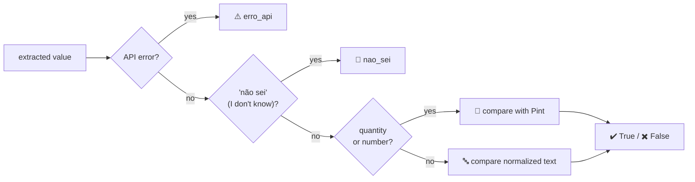

<div align="center">

# LLMs × Microcontroller Datasheets

**Evaluating language models at extracting technical specifications of microcontrollers,<br>with and without RAG, with and without instruction.**

[Assessment of Hallucinations in LLMs and RAG as a Mitigation Technique, in the Context of Microcontroller Datasheets] · [PPGESE] · [UFSC]

<br>


<br>

| 🧩 **456** microcontrollers | ❓ **2,736** questions | 🏭 **9** manufacturers | 🧪 **4** test categories |

</div>

---

## 📖 Table of contents

- [About the project](#-about-the-project)
- [Experimental design](#-experimental-design)
- [Repository structure](#-repository-structure)
- [Installation](#️-installation)
- [API key configuration](#-api-key-configuration)
- [How to run](#️-how-to-run)
- [Evaluation criteria](#-evaluation-criteria)
- [Output format](#-output-format)

---

## 🎯 About the project

Language models answer technical questions fluently, but **they don't always get the numbers right**. This project measures how often LLMs get the specifications of real microcontrollers right and investigates two factors:

- **RAG (*Retrieval-Augmented Generation*):** does giving the model excerpts from the official datasheets improve accuracy?
- **Instruction:** does explicitly asking *"If you don't know the answer, return 'I don't know'"* reduce wrong answers?

For each microcontroller in the dataset, six questions are asked to the models. The answers are compared against the reference values in the spreadsheet.

> [!NOTE]
> All prompts were issued in **Portuguese**. The questions below are shown in English for readability.

| # | Question (example with the ATmega328P-PU) | Reference answer | Type |
|:-:|---|:-:|:-:|
| 01 | What is the flash memory of the microcontroller…? | `32KB` | 🔢 quantity |
| 02 | What is the speed (clock) of the microcontroller…? | `20MHz` | 🔢 quantity |
| 03 | How many inputs and outputs (I/O) does…have? | `23` | 🔢 number |
| 04 | Does the microcontroller… support CAN bus communication? | `No` | ✅ yes / no |
| 05 | Does the microcontroller… support I2C communication? | `Yes` | ✅ yes / no |
| 06 | Does the microcontroller… support Ethernet communication? | `No` | ✅ yes / no |

---

## 🧪 Experimental design

Each model is evaluated in **four categories**, resulting from crossing two factors:

<div align="center">

|  | **Without instruction** | **With instruction** <br><sub>"If you don't know, return 'I don't know'"</sub> |
|:---:|:---:|:---:|
| **Without RAG** <br><sub>model knowledge only</sub> | `sem_rag_sem_instrucao` | `sem_rag_com_instrucao` |
| **With RAG** <br><sub>+ datasheet excerpts</sub> | `com_rag_sem_instrucao` | `com_rag_com_instrucao` |

</div>

Both instruction variants of the same question use **exactly the same retrieved context**, so the instruction is the only difference between them.

### 🤖 Evaluated models

| Model | Provider
|---|---
| `gemini-2.5-flash` | Google Gemini 
| `microsoft/phi-4-mini-instruct` | NVIDIA NIM 
| `openai/gpt-oss-20b` | NVIDIA NIM
| `@cf/meta/llama-4-scout-17b-16e-instruct` |  NVIDIA NIM
| `@cf/mistralai/mistral-small-3.1-24b-instruct` | NVIDIA NIM

<details>
<summary><b>⚙️ RAG parameters</b></summary>

<br>

| Parameter | Value |
|---|---|
| Embedding model | `qwen3-embedding` (local, via Ollama) |
| Vector database | ChromaDB, cosine distance |
| Chunk size / overlap | 768 / 120 characters |
| Retrieved candidates | 20 |
| Chunks sent to the model | 5 (after filtering by microcontroller part number and removing duplicates) |
| Text extraction | `unstructured` (`partition_html`) |

The filter uses the *part number* mentioned in the question (e.g., `ATMEGA328P`, `STM32F103`) and gives preference to chunks from that component's datasheet. If no chunk matches, the most similar ones are used.

</details>

---

## 📁 Repository structure

```
.
├── 📓 script-unificado.ipynb          # Without RAG: queries the 6 models (with/without instruction) and extracts the values
├── 📓 1. script_rag_v3_html.ipynb     # With RAG: builds the vector database and generates the answers (with/without instruction)
├── 📓 2. extracao.ipynb               # Extracts the value from the RAG answers (gemini-2.5-flash)
├── 🐍 junta_resultados.py             # Merges all results into a single file
├── 🐍 avalia_respostas_rag.py         # Classifies each answer and summarizes by model and category
├── 🐍 plota_histogramas.py            # Histograms, boxplots, and size × accuracy correlation
├── 📊 microcontroladores-populares.xlsx  # Dataset: questions and reference answers
├── 📄 datasheets_pdf/                 # Manufacturer datasheets (see installation section)
└── 📦 requirements.txt
```

---

## 🛠️ Installation

**Prerequisites:** Python 3.10+ and, for the RAG part, [Ollama](https://ollama.com) installed locally.

```bash
# 1. Clone the repository
git clone https://github.com/<user>/<repository>.git
cd <repository>

# 2. Create and activate a virtual environment
python -m venv .venv
source .venv/bin/activate        # Windows: .venv\Scripts\activate

# 3. Install the dependencies
pip install -r requirements.txt

# 4. Download the embedding model (RAG part only)
ollama pull qwen3-embedding
```

> [!NOTE]
> **Datasheets:** the PDFs (~1.2 GB) are available in [`datasheets_pdf.zip`]. Extract the file at the repository root, into the `datasheets_pdf/` folder.

> [!IMPORTANT]
> The vector database is built from the datasheets **in HTML**, read from the `datasheets_html/` folder. Converting the PDFs to HTML is an external step and **is not part of this repository**.

---

## 🔑 API key configuration

The keys go in the notebooks' configuration cells, replacing the placeholder text `SUA_API_AQUI`:


## ▶️ How to run

<table>
<tr><th>Step</th><th>Command / action</th><th>Produces</th></tr>
<tr><td><b>1</b> · Without RAG</td><td>Run all cells of <code>script-unificado.ipynb</code></td><td><code>resultados_sem_rag.json</code><br><code>performance_sem_rag.html</code></td></tr>
<tr><td><b>2</b> · Vector database</td><td>Run cell 0 of <code>1. script_rag_v3_html.ipynb</code> <br><sub>processes in batches; repeat until all files are processed</sub></td><td><code>vector_db_v3/</code><br><code>processed_pdfs_v3.txt</code></td></tr>
<tr><td><b>3</b> · With RAG</td><td>Run cell 2 (NVIDIA) and/or cell 3 (Gemini) <br><sub>cell 1 is a manual test with a single question</sub></td><td><code>resultados_rag_&lt;model&gt;_v3.json</code></td></tr>
<tr><td><b>4</b> · Extraction</td><td>Run the cells of <code>2. extracao.ipynb</code></td><td><code>resultados_rag_&lt;model&gt;_v3_extraido.json</code></td></tr>
<tr><td><b>5</b> · Merge</td><td><code>python junta_resultados.py</code></td><td><code>dados_combinados_v3.json</code></td></tr>
<tr><td><b>6</b> · Evaluation</td><td><code>python avalia_respostas_rag.py</code></td><td><code>correto</code> field in each answer<br>summary in the terminal</td></tr>
<tr><td><b>7</b> · Charts</td><td><code>python plota_histogramas.py</code></td><td><code>histogramas_modelos.pdf</code><br><code>resumo_modelos.csv</code></td></tr>
</table>

<details>
<summary><b>🔁 Resuming and API error handling</b></summary>

<br>

All three notebooks **can be interrupted and resumed**. When run again, they reuse what has already been done and process only the remainder.

- Every failed API call is retried **up to 3 times**, with increasing wait times (5 s, 10 s).
- If all attempts fail, the answer is saved as `erro_api: <reason>` and is not sent to extraction.
- **Just run the cell again**: only answers marked `erro_api` are redone.
- In the evaluation, `erro_api` is a separate category. It does not count as a wrong answer and is excluded from the percentages.

To start from scratch, delete the output file of the corresponding notebook.

</details>

<details>
<summary><b>➕ Adding new results to the comparison</b></summary>

<br>

Add the file to the `ARQUIVOS_ENTRADA` list in `junta_resultados.py`:

```python
ARQUIVOS_ENTRADA = [
    "resultados_sem_rag.json",
    "resultados_rag_phi-4-mini_v3_extraido.json",
    "resultados_rag_gemini-2.5-flash_v3_extraido.json",
    "resultados_rag_novo-modelo_v3_extraido.json",   # ← new
]
```

The script also reads files produced by earlier versions of the notebooks. It identifies the category from the model name or the file name (e.g., `..._com-instrucao.json`).

</details>

---

## ✅ Evaluation criteria

All categories and all scripts use **the same criterion**, defined in the `classificar_resposta()` function of `avalia_respostas_rag.py`:


```mermaid
flowchart LR
    R["extracted value"] --> E{"API error?"}
    E -- yes --> X["⚠️ erro_api"]
    E -- no --> N{"'não sei'<br/>(I don't know)?"}
    N -- yes --> NS["🤷 nao_sei"]
    N -- no --> G{"quantity<br/>or number?"}
    G -- yes --> P["📏 compare with Pint"]
    G -- no --> T["🔤 compare normalized text"]
    P --> V["✔️ True / ✖️ False"]
    T --> V
```

| Type | Comparison | Examples considered **equal** |
|---|---|---|
| 🔢 Memory and clock | [Pint](https://pint.readthedocs.io) library, with unit conversion | `1MB` = `1024KB` · `72MHz` = `0.072GHz` · `3,5KB` = `3.5 KB` |
| 🔢 I/O count | Pint (dimensionless value) | `37` = `37.0` |
| ✅ Yes / No | Text without accents, case, or punctuation | `Não` = `NAO` = `não.` |

> Memory uses **binary** units (1 KB = 1024 B), as in the datasheets.

---

## 📦 Output format

<details>
<summary><b>Example of an item in <code>dados_combinados_v3.json</code></b></summary>

<br>

```json
{
    "linha_excel": 1,
    "coluna_pergunta": "PERGUNTA01",
    "pergunta": "Qual a memória flash do microcontrolador AVR® ATmega ATMEGA328P-PU?",
    "resposta_verdadeira": "32KB",
    "coluna_resposta": "Flash Memory",
    "contexto_recuperado": [
        { "chunk_content": "…", "source_file": "…" }
    ],
    "respostas_modelos": [
        {
            "modelo": "gemini-2.5-flash_com_rag_com_instrucao",
            "modelo_base": "gemini-2.5-flash",
            "rag": true,
            "instrucao": true,
            "resposta_completa": "O ATmega328P-PU possui 32 KB de memória flash…",
            "valor_extraido": "32KB",
            "correto": true,
            "modelo_extracao": "gemini-2.5-flash"
        }
    ]
}
```

The `correto` field can be `true`, `false`, `"nao_sei"`, or `"erro_api"`.

</details>

---

<div align="center">

<sub>The datasheets belong to their respective manufacturers and are provided solely for reproducing this research.</sub>

</div>
